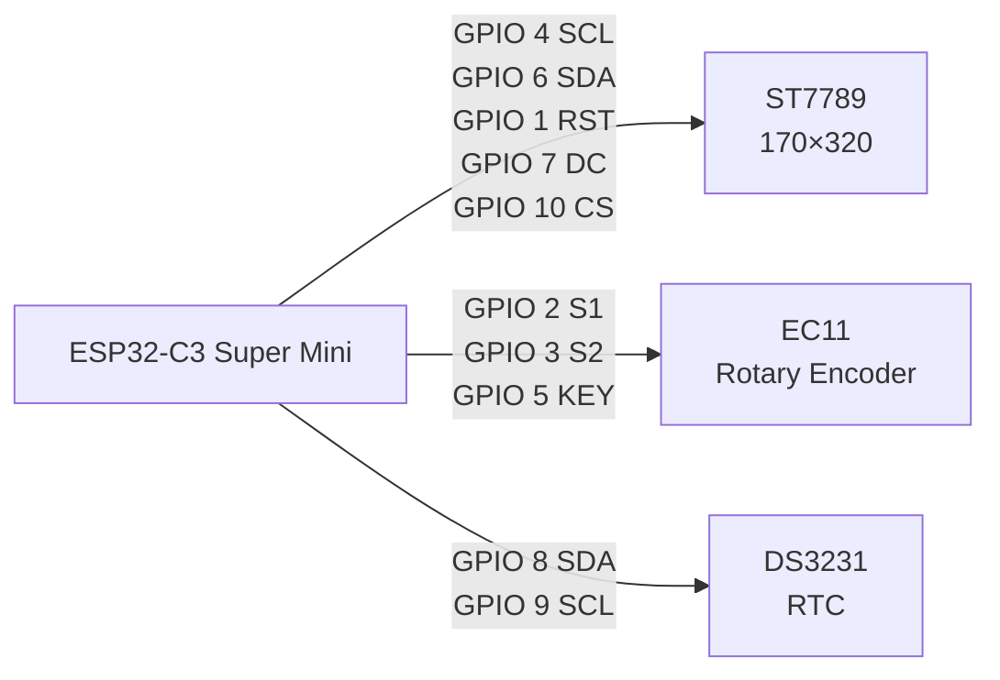

# IN-14 Virtual Nixie Clock

A realistic **single-tube IN-14 clock** built with an ESP32-C3 Super Mini and a 170×320 ST7789 display.

The project recreates the look of a Soviet IN-14 nixie tube using custom graphics. The display shows one digit at a time, with the glow of the filament and visible tube structure preserved in the artwork.

## ✨ Features

- 🕐 Single virtual IN-14 nixie tube
- 🎛️ EC11 rotary encoder for setting the time
- ⏱️ DS3231 real-time clock
- 🔋 Time continues running when the ESP32 is powered off
- 🎨 Custom 170×320 IN-14 graphics
- 💡 Filament and tube grid remain visible
- 📺 ST7789 IPS display
- 💾 Compact 64-color image format optimized for ESP32-C3
- 🚫 No `RTClib`
- 🚫 No `TJpg_Decoder`
- 🚫 No filesystem or SD card required

## 🧩 Hardware

| Component | Description |
|---|---|
| ESP32-C3 Super Mini | Main controller |
| ST7789 | 170×320 IPS display |
| TENSTAR EC11 | Rotary encoder with push button |
| DS3231 | Real-time clock module |
| 3.3V supply | Logic/display supply |

## 🔌 Wiring

The connection overview below is rendered directly by GitHub using Mermaid:



### ST7789

| ST7789 | ESP32-C3 |
|---|---|
| SCL | GPIO 4 |
| SDA | GPIO 6 |
| RST | GPIO 1 |
| DC | GPIO 7 |
| CS | GPIO 10 |
| BLK | 3.3V |
| VCC | 3.3V |
| GND | GND |

### EC11

| EC11 | ESP32-C3 |
|---|---|
| S1 | GPIO 2 |
| S2 | GPIO 3 |
| KEY | GPIO 5 |
| VCC | 3.3V |
| GND | GND |

### DS3231

| DS3231 | ESP32-C3 |
|---|---|
| SDA | GPIO 8 |
| SCL | GPIO 9 |
| VCC | 3.3V |
| GND | GND |

## 🎛️ Time setting

The encoder uses three button presses to move through the setup states.

### 1. Set hours

Press the encoder once.

For example:

```text
12 → 13 → 14 → 15 → ...
```

Clockwise increases the hour.

Counter-clockwise decreases the hour.

The valid range is:

```text
00–23
```

### 2. Set minutes

Press the encoder again.

For example:

```text
29 → 30 → 31 → 32 → ...
```

The valid range is:

```text
00–59
```

### 3. Save

Press the encoder a third time.

The selected `HH:MM` is written to the DS3231 and the clock returns to normal operation.

## 🕐 Display sequence

For example, when the time is **15:31**:

```text
1 → 5 → [blank] → 3 → 1 → [blank] → repeat
```

Current timing:

- Digit: **550 ms**
- Between hours and minutes: **700 ms**
- After minutes before the next hour: **1300 ms**

So the viewer naturally reads it as:

```text
15 | 31
```

rather than as four unrelated digits.

## 📁 Project structure

```text
IN14-Virtual-Nixie-Clock/
│
├── README.md
├── LICENSE
│
├── src/
│   └── IN14_Virtual_Nixie_Clock.ino
│
├── images/
│   ├── img_none.h
│   ├── img_0.h
│   ├── img_1.h
│   ├── ...
│   └── img_9.h
│
├── hardware/
│   └── wiring.svg
│
└── docs/
```

## 🚀 Uploading

1. Install the ESP32 board package in Arduino IDE.
2. Select **ESP32C3 Super Mini** / the appropriate ESP32-C3 board profile.
3. Open:

```text
src/IN14_Virtual_Nixie_Clock.ino
```

4. Make sure the `images` folder is kept with the project when compiling.
5. Connect the ESP32-C3.
6. Select the correct COM port.
7. Upload.

The project intentionally avoids additional RTC and JPEG decoder libraries. The display images are stored in compact indexed RGB565 data directly in the firmware.

## 🔮 Planned features

Possible future versions:

- Wi-Fi NTP time synchronization
- Automatic time-zone handling
- Smooth IN-14 digit transitions
- Adjustable brightness
- Multiple display animations
- 12/24-hour mode
- Alarm clock
- Temperature display from DS3231
- More realistic tube glow

## 📸 Project idea

The goal is to recreate the visual character of a real **IN-14 nixie tube** without using a high-voltage nixie tube.

Instead of simply drawing a number, each frame contains the tube structure, grid and glowing filament, while only the selected numeral is illuminated.

## 📜 License

MIT License — see `LICENSE`.
